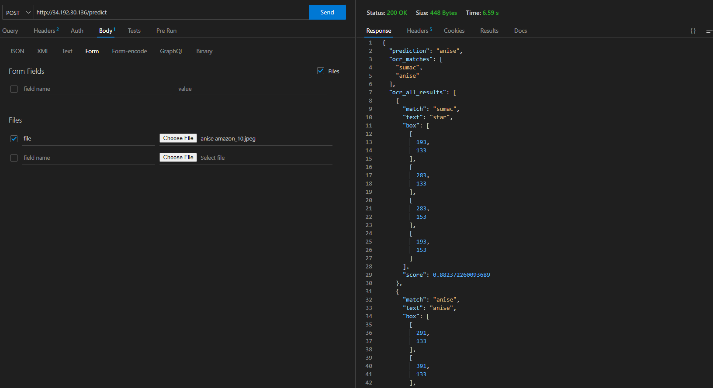
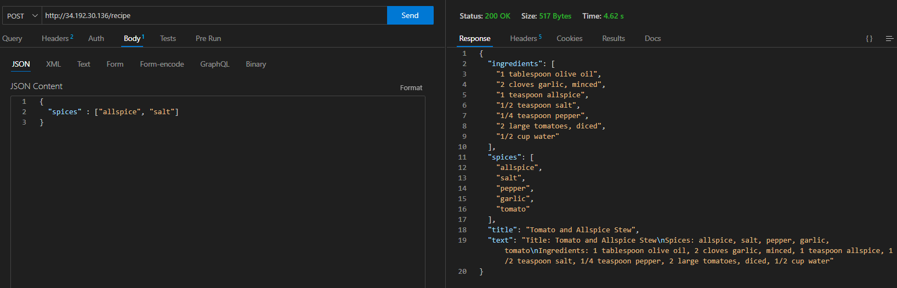

# DGMD API Interfaces

This code-base provides implementation of Fast API based api interfaces for DGMD Application.  An example of common API usage can be found [here](https://github.com/hssrobotics23/app-deployment/blob/main/example/example_usage.ipynb).

## Deployed APIs

|API Endpoint | Description |
|--|--|
| / | provides a "hello world" type of message to indicate APIs are up.|
| /models/list | provides a list of models currently available within MLFlow.  By default the current _Production_ tagged model in MLFlow is used. |
|/models/load | takes 2 parameters: model_name, model_stage to manually load a model from MLFlow if desired.  This is used to test models in live environment without changing back-end MLFLow tagging (or in some instances to reload a new Production model without application restart).|
| /predict | returns an image and OCR prediction based on POSTED binary image file.|
| /recipe | provides a CHAT-GPT generated recipe based on provided JSON file indicating spices to include.|

## Example Usage

Example usage images below using [Thunder Client](https://www.thunderclient.com/) for illustrative purposes.

### /predict



### /recipe




## Setup

Application can be setup for development purposes via the following:

```bash
>> conda create --name api python=3.8
>> conda activate api
>> pip install -e .

```

Fast API application can then be launched via:

```bash
>> uvicorn main:app --host 0.0.0.0 --reload --port 8080
```

Alternatively (recommended) application can be launched as a Docker container:

```bash
>> docker build -t dgmd_api .
>> docker run -p 8080:8080 dgmd_api
```

